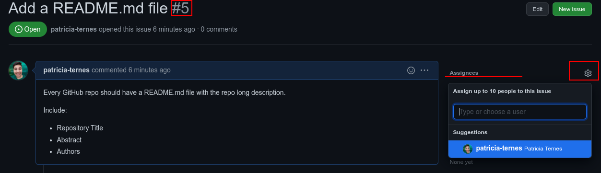
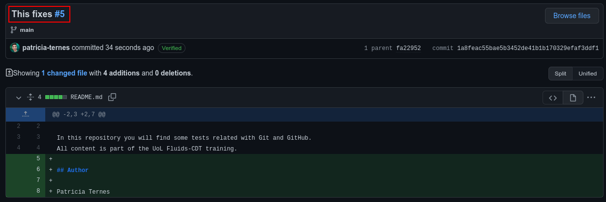
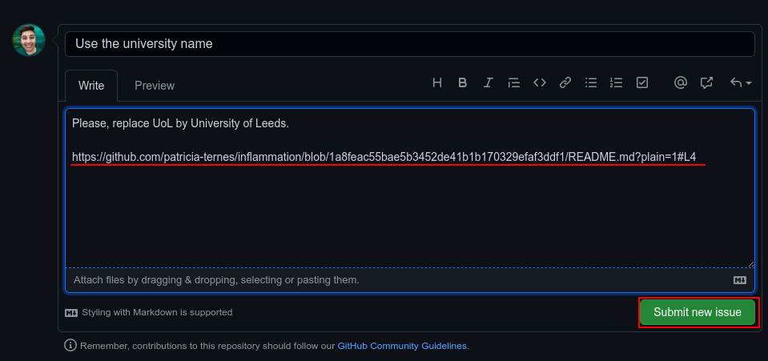
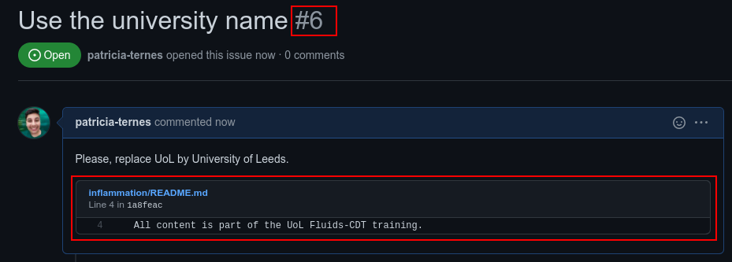

# GitHub issues

GitHub has a very useful tool to help organize our own tasks. This same tool is
very powerful for working collaboratively. This is the "Issues" tool:


## Creating our first Issue

Every GitHub has a Issue tab. Let's open a very simple Issue - click in the
green button "New issue". A window very similar to the "Pull request" will
open:


- We are going to point that it is a good idea to create a README.md file.
- We are also going to point some useful content that should appear in this file.
- We are going to include a label for the issue.

Then, press the `Submit new issue` button.

## Working on our first Issue

Before solve any Issue we should careful read the issue description and then
assign ourselves to the task. This will prevent more than one person working
in the same task.

- Select the desired Issue
- Click in "Assigners"
- Add yourself.



```{note}
Take note about the Issue number (here `#5`).
```

Now solve the issue. You can work in your local machine and then make a pull
request (the best approach). Here, for simplicity, I am work directly on GitHub.

To do this, go to "code" tab and create a new file (`Add file`).
As README is a very standard file, there is a suggestion to do this. Just click
on the green `Add a README`:


Now, just type the changes:


After that, you should commit your changes (remember that if you are working
on GitHub, there is no staging area and every change is a commit). You can
put any commit message here, but there is an **advanced trick** you should use:

**Add to your commit the link for the issue by adding a `#` and the issue
number**


## Review the issue

*The work that we did was enough to solve the Issue? Can we close the Issue?*

The main idea of having Issues is not having Issues, so, the ideal scenario is
commit changes and close issues, but we can only do that, if our work did
everything that was necessary. In this example, if we compare the Issue with the
commit, we can see that the authors information is still missing, so the
issue must remain open. We can add a comment about this:


## Closing the issue: the "pro" approach

As you can see in the image above, we could manually close the issue if
everything was done. But, if we are completely sure that our change solve the
problem, we could do this with the commit message. So, let's finally finish
this issue:

- open the README.md file
- add the missing information
- commit the change with a **keyword** and the issue link (here: `#5`)

See my commit:



Now you can navigate in your Issues tab and see that your Issue was automatically
closed. If you navigate into the closed issues, you can see that all commits
and comments related to this issue is organized and anything was lose.

Some possible **keywords**:

- fix
- fixes
- close

```{seealso}
See the GitHub Docs about 
[Links to Issues](https://docs.github.com/en/issues/tracking-your-work-with-issues/linking-a-pull-request-to-an-issue)
```

## Issue in specific files

Our first issue was a general repository problem. Now, we are going to see how
to work with issues in specific files. Let's try a generic example, imagine that
you see:

- a problem X
- in the line Y
- of file Z

If we open an issue following the above steps, the problem X is not be directly
linked with file Z. So the person solving the problem should find the right file
and line before thinking about the problem itself.

We can make this workflow better. We are going to use the README.md file as
example again, so first step is open the file on GitHub in the source view
(some file open automatically in this view, some not.).


In the source view, the line numbers should appear in the left corner. After
find a problem, you can click on the line number and a `...` will appear. Now,
click in this "more" button and choose the "Reference in new issue" to
automatically create a issue linked with this line.


```{note}
The GitHub is going to use a "permalink" to reference this file/line with the
issue. You could also use the "permalink" to reference this file/line in other
places (or to create the issue manually).
```

```{tip}
If your problem is on more than one line, you can select multiple lines
and reference them all together.
```

The procedure from here is similar to before. The only difference is the
link in your message. Write your title/message and submit.



Now look your new Issue:



You can note that the permalink was rendered as a file link plus a view of
linked lines. You can directly click on the file, and solve the issue. Remember
of use the Issue Number (here `#6`) in the commit message the improve your
workflow.
