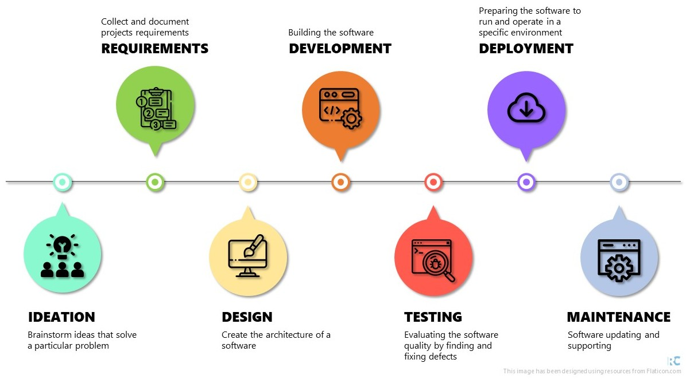

# Software Development Life Cycle

Most coding trainings/lessons just focus on developing coding writing skills.
However, this is just a step in the software development process.

**Software Development Life Cycle (SDLC)** is a cycle composed of seven steps:

* Ideation
* Requirements
* Design
* Development
* Testing
* Deployment
* Maintenance

