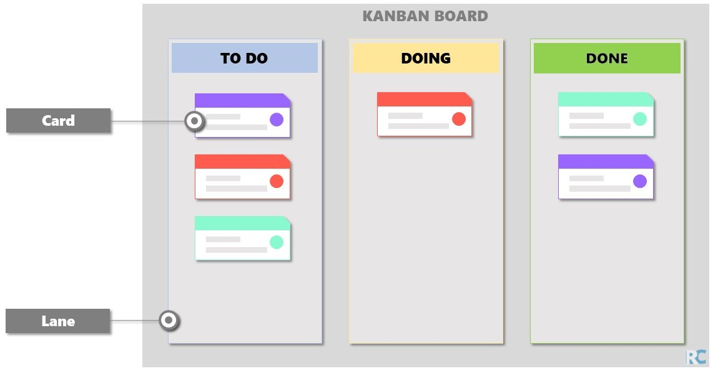

# Tasks & Kanban

When the project can be **divided into tasks**, it is convenient to manage the
workflow using the Kanban method.

```{admonition} Definition
:class: note
The term Kanban comes from Japanese and translates as “signal card”. Originally,
Kanban was used in Toyota’s production facilities, where it also influenced 
agile development in IT and other departments. The aim is to establish a 
constant, orderly workflow. Moreover, Kanban can be combined with other agile 
methods such as Scrum.

\- [IONOS](https://www.ionos.co.uk/digitalguide/websites/web-development/about-kanban/)
```

Kanban can be used to managing workflow from the individual up to organizational
level.

## Simple Kanban Board

The Kanban board helps to visualize and optimise the workflow.
The board is organised through lanes (columns) and cards, where:

- **Lanes**: defined steps
- **Cards**: represent project tasks

By separating the cards in lanes it is easy to see the status of each task as
well as the entire project workflow. See a simple Kanban board representation
bellow:



```{tip}
Note that the in a Kanban board the task begins on the left side and as the task
progresses through the execution steps, it is moved to the right lanes.
```

## Useful Cards Content

- Title
- Description
- Attachments and links
- Card type (usually distinguished by color)
- Assignment
- Card & comment history
- Subtasks
- Due date

## Software Development: Useful Lanes

- Backlog (To Do: Unprioritized)
- Ready (To Do: Prioritized)
- Plan
- Develop (Coding)
- Testing
- Pending Final Approval
- Deployment
- Done

## Useful Improvements

- Work-in-progress (WIP) limit: number of allowed open cards
- Include more lanes
- Priority lanes
- Swimlanes: horizontal line to divide different groups
