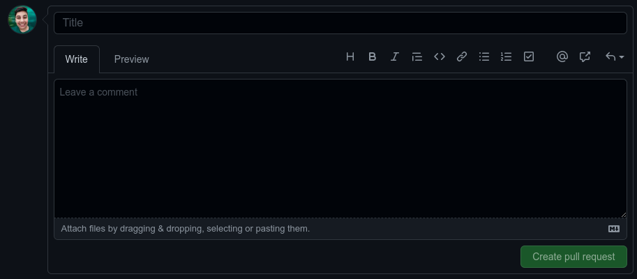

# Synchronizing: Visual Studio Code way

In this section we are going to repeat the steps of create and synchronizing
local/GitHub repositories, but now we are going to use the Visual Studio Code
instead of the terminal.

## Local --> GitHub

First open your local git repository. On the lef bar choose the `Explorer` icon,
and then click on the `Open Folder` button:


The second step is open the `Source Control` tab (also on the left bar).
This tab offer several Version Control features. For instance we are interested
in create a remote (link) with GitHub. So, go to the `Remotes` and click on `+`
(add remote):


A new tab on the top center will popup asking for the remote name. We strongly
recommend the `origin` name. Type the name and press enter.


After that, a very similar tab will popup. Now you should add the github link.
To get this link you need first to create an empty repository on GitHub.


Now you should push your changes.


```{note}
Following the above steps you did the same git bash steps, but in a 
graphic interface.
```

## Local --> GitHub: even simpler

Let's starting again open a local git repository.
On the lef bar choose the `Explorer` icon,
and then click on the `Open Folder` button:


Now, look for a cloud symbol in the bottom bar.
Don't worry if you don't see all the symbols in the image below,
they depend on the installed extensions.


A new bar should popup on the top.
VSC will automatically suggest that the local repository be published on GitHub.
The same name is suggested, but you can change it if you wish. You can also
choose between a public or private repository. Click in your desired option and
wait.


```{warning}
If you chose a name that already exist in your GitHub an error will popup.
You always need an empty GitHub repo to setup a remote.
If this occurs, just try again with a different repo name.
```

A couple of box may appear. One saying that the repository was
successfully published, and other suggesting to crate a pull request.
Just close them. For now, everything is done!

```{note}
you didn't need to create an empty repository on github, nor perform a push of
your files, VSC did it automatically for you.
```

## GitHub --> Local

Here the procedure is very similar to `bash`, but in a graphical interface.

Go again to the `Explorer` icon on left bar,
and then click on the `Clone Repository` button:


A new box will popup. Select the GitHub option, and some repository options are
going to be listed. You can search and select the desired repo to clone.


Then, select the place to store your repo.

## Add and commit using VSC

After working for a while without add or commit your changes, you will notice a
series of tags next to your files in Visual Studio Code.
See this horrible example:


The tags are:

- `U`: Untracked - files that never were tracked by git (never were added to staging area)
- `M`: Modified - files that were modified since last commit
- `numbers`: Number of problems in the file (like spellcheck problems)

Another thing you can notice in this image is that the "Source Control" icon
indicates the amount of changes that were not included in git
(49 in this example).

Move to this tab and let's see how VSC helps us organize our work even when we
are extremely disorganized.


All changed files are displayed here. To view the changes You can select a file.
The old and the new version are going to be displayed and the differences are
going to be highlighted. Once you understand what the change is about you can
add the file to the staging area by clicking the plus button (this is equivalent
to git add).

Before moving on to a committee, it's worth checking to see if any of the other
changes fit the same topic/subject. Just browse through the files, review the
changes and add to the staging area whatever you think is relevant for the same
commit. Before commit, you can review all staged files. If necessary remove than
from staged area using the `-` button.


**Advanced tip:** Sometimes we make several changes within the same file,
but not all of these changes belong to the same commit. For example,
when writing a paper you can separate a commit for each session, but all
sessions are in the same file. Another example is shown in the image below,
where the table of contents was changed in different sessions and I wanted to
add only one session to the commit.


In VSC you can easily add the desired part in the staging area. For that:

- Select the desired text
- Right click
- Choose the "Stage Selected Ranges" option

After group all related changes in the staged are, you are ready to commit.
Now type a commit message on the above space, and press the check button
(equivalent to `git commit -m "message"` command).


Now, repeat the process of review changes, add related changes to staging area,
and committing them, until the `Changes` tab is empty. In this point the `sync`
button should appear (this is equivalent to `git push origin main`):


## Push local changes to a remote repo using a different branch

Let's improve a little bit our GitHub skills. You should not push anything to
your main branch. The standard approach is to submit your changes in a new branch
and then make a pull request.

First things first: create a new branch on VSC:


A box to type the branch name will appear. Type something meaningful and press
enter. After that, in the commit box, you should be able to see the new branch
name. After check that you are on the right branch, press the `Publish` button.

You can also use the `Branches` section under the `Source Control` tab for a
complete branch management options. In this
section you can see all available branches, checkout to another branch with one
click, create a new branch and more.


## Compare & pull request

Now is time to combine your "new-branch" with the main branch. You can do this
inside the VSC, but I suggest to do this directly on GitHub (let's use the
better from every world). So, open your GitHub repo and a suggestion for pull
request should be on the `<> code` tab. Press the `Compare & pull request`
button.


The first and basic thing is verify if the branches can be merged. GitHub
is going to flag this for us.


The next thing is create the message for the pull request. This includes a
Title and a long description. You can add files, links, mention collaborators,
etc. Note that the message can be written in markdown, this includes headers,
lists, and tables.



Before submit the pull request you can also tweak some configurations (right
column).


Two of these options are are really important:

- Reviewers: someone you want to review the changes.
- Assignees: someone responsible for accept or not the pull request.

## A standard collaborative workflow

In practice, it is good to be sure that you have an updated version of the
repository you are collaborating on, so you should git pull before making our
changes. The basic collaborative workflow would be:

- update your local repo,
- create a new branch,
- make your changes and stage,
- commit your changes,
- upload the changes to a new branch on GitHub, and
- create a pull request.
