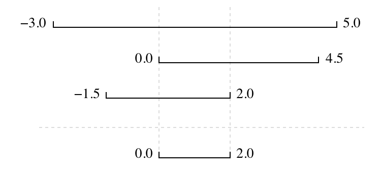

# Test-driven development

An assertion checks that something is true at a particular point in the program. The next step is to check the overall behaviour of a piece of code, i.e., to make sure that it produces the right output when it’s given a particular input. For example, suppose we need to find where two or more time series overlap. The range of each time series is represented as a pair of numbers, which are the time the interval started and ended. The output is the largest range that they all include:



## Naive solution

- Write a function `range_overlap`.
- Call it interactively on two or three different inputs.
- If it produces the wrong answer, fix the function and re-run that test.

This clearly works — after all, thousands of scientists are doing it right now — but there’s a better way

## Test-driven development solution

- Write a short function for each test.
- Write a `range_overlap` function that should pass those tests.
- If `range_overlap` produces any wrong answers, fix it and re-run the test functions.

Writing the tests before writing the function they exercise is called **test-driven development (TDD)**.
Its advocates believe it produces better code faster because:

- If people write tests after writing the thing to be tested, they are subject to confirmation bias, i.e., they subconsciously write tests to show that their code is correct, rather than to find errors.
- Writing tests helps programmers figure out what the function is actually supposed to do.

## Possible tests: range overlap example

Let's think in all possible scenarios for this problem and how we could test them.

### No overlap

Considering two or more ranges, there is a possibility that there is no overlap.

Example:

- Using this range `[(0.0, 1.0), (5.0, 6.0)]`, the answer should be `None`.

:::{dropdown} Check the example code:

```python
assert range_overlap([ (0.0, 1.0), (5.0, 6.0) ]) == None
```

:::

### Length zero

Considering two or more ranges, there is a possibility that there are two points
with the same value, but still not overlapping.

Example:

- Using this range `[(0.0, 1.0), (1.0, 2.0)]`, the answer should be `None`.

:::{dropdown} Check the example code:

```python
assert range_overlap([ (0.0, 1.0), (1.0, 2.0) ]) == None
```

:::

### Single range

If we pass just one range, the overlapping should be the same range.

:::{dropdown} Check the example code:

```python
assert range_overlap([ (0.0, 1.0) ]) == (0.0, 1.0)
```

:::

Or... we could define that we need at least two ranges!

### Negative range

If one of our ranges has a negative value, the code returns the desired value?

Example

- the ranges `[(0.0, 1.0), (0.0, 2.0), (-1.0, 1.0)]` should return the overlapping
`(0.0, 1.0)`

:::{dropdown} Check the example code:

```python
assert range_overlap([ (0.0, 1.0), (0.0, 2.0), (-1.0, 1.0) ]) == (0.0, 1.0)
```

:::

### Other possibilities

- same ranges
- overlapping ranges
- tree or more ranges

## Range overlapping function

::: {dropdown} Check an idea for the `range_overlap` function

```python
def range_overlap(ranges):
    """Return common overlap among a set of [low, high] ranges"""
    lowest = ranges[0][0]
    highest = ranges[0][1]
    for (low, high) in ranges:
        lowest = max(lowest, low)
        highest = min(highest, high)
        if lowest > highest:
            return None
        elif lowest == highest:
            return None
        else:
            return (lowest, highest)
```

:::
